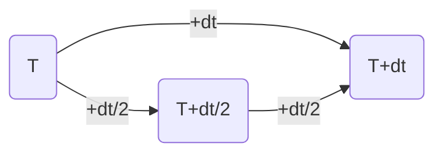

# Simulation of Rutherford scattering
## Introduction 
For Ruthford scattering see : [Link](http://hyperphysics.phy-astr.gsu.edu/hbase/rutsca.html#c3)
## Method 
Simulate with fourth order Runge-Kutta and Adaptive Runge-Kutta method.

For Fourth order Runge-Kutta see : [Link](https://en.wikipedia.org/wiki/Runge%E2%80%93Kutta_methods)

For Adaptive Runge-Kutta, we perform a fourth order Runge-Kutta with time step $dt$ and two half time step $dt/2$. We compare the result of the two half time step with the result of the full time step. If the difference $|\delta{c}|$ is smaller than a certain tolerance, we accept the result of the full time step. Otherwise, we perform two half time step again. We repeat this process until the difference is smaller than the tolerance.

Since the local truncation error of fourth order Runge-Kutta is $O(h^5)$, therefore, our truncation error for current time step will be $|\delta{c}|^{1/5}$. Assume that the local truncation error's tolerance we set is $\epsilon$, then the fraction of these two value can help us to determine the time step for next step. by following equation:

$$\tau_{est} = \tau_{old}|\frac{\epsilon}{\delta{c}}|^{1/5}$$

Since this is only the estimation of the time step, we introduce two safety factor $s_1<1$ and $s_2>1$ to make sure that the time step will not be too small or too large. Therefore, the final time step will be:
$$
\begin{equation}
T_{new} = \begin{cases}
    S_2\tau_{old}  &\text{if } S_1\tau_{est}>S_2\tau_{old}\\ 
    \tau_{old}/S_2 &\text{if } S_1\tau_{est}<tau_{old}/S_2\\
    S_1\tau_{esr}  &\text{otherwise}\\
     \end{cases}
\end{equation}
$$

## Result
 
