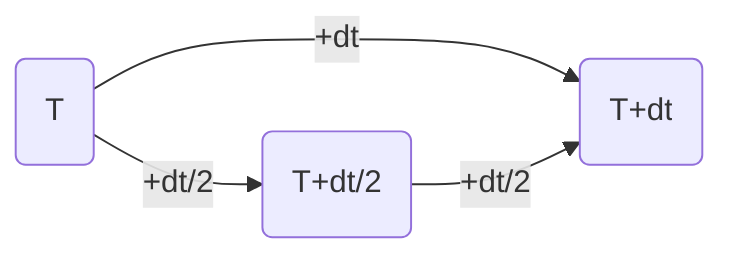
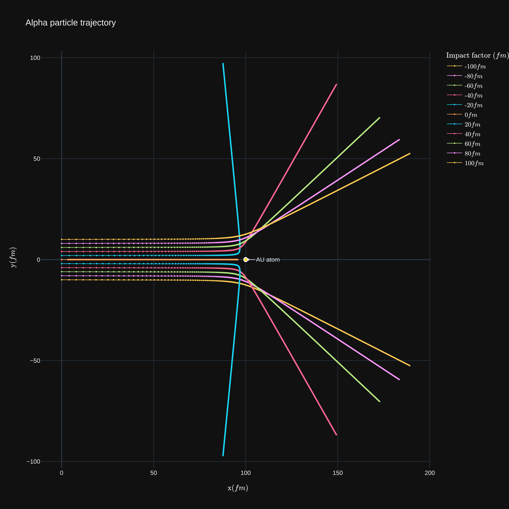

# Simulation of Rutherford scattering
## Introduction 
For Ruthford scattering see : [Link](http://hyperphysics.phy-astr.gsu.edu/hbase/rutsca.html#c3)
## Theory 
The incident alpha particle will be deflected by the Coulomb force from the gold nucleus. The Coulomb force is given by:

$$\vec{F} = \frac{Z_1Z_2e^2}{4\pi\epsilon_0r^2}\hat{r}$$

where $Z_1$ and $Z_2$ are the charge of the alpha particle and the gold nucleus respectively, $e$ is the elementary charge, $\epsilon_0$ is the vacuum permittivity and $r$ is the distance between the alpha particle and the gold nucleus. Apply Newton's law of motion, the trajectory of the alpha particle can be calculated by the following equation:
$$\frac{d^2\vec{r}}{dt^2} = \frac{Z_1Z_2e^2}{4\pi\epsilon_0m\vec{r}^2}\hat{r}$$
where $m$ is the mass of the alpha particle. We can rewrite the equation in the following form:

$$\frac{d^2\vec{r}}{dt^2} = \frac{Z_1Z_2e^2}{4\pi\epsilon_0m}\frac{\vec{r}}{\vec{r}^3}$$

Solve the equation of motion with given initial condition (initial velocity & initial position), we can get the trajectory of the alpha particle.
## Method 
Simulate with fourth order Runge-Kutta and Adaptive Runge-Kutta method.

For Fourth order Runge-Kutta see : [Link](https://en.wikipedia.org/wiki/Runge%E2%80%93Kutta_methods)

For Adaptive Runge-Kutta, we perform a fourth order Runge-Kutta with time step $dt$ and two half time step $dt/2$. We compare the result of the two half time step with the result of the full time step. If the difference $|\delta{c}|$ is smaller than a certain tolerance, we accept the result of the full time step. Otherwise, we perform two half time step again. We repeat this process until the difference is smaller than the tolerance.

Since the local truncation error of fourth order Runge-Kutta is $O(h^5)$, therefore, our truncation error for current time step will be $|\delta{c}|^{1/5}$. Assume that the local truncation error's tolerance we set is $\epsilon$, then the fraction of these two value can help us to determine the time step for next step. by following equation:

$$\tau_{est} = \tau_{old}|\frac{\epsilon}{\delta{c}}|^{1/5}$$

Since this is only the estimation of the time step, we introduce two safety factor $s_1<1$ and $s_2>1$ to make sure that the time step will not be too small or too large. Therefore, the final time step will follow these condition : 
1. $S_2\tau_{old}  \text{\ \ , if \ } S_1\tau_{est}>S_2\tau_{old}$
2. $\tau_{old}/S_2 \text{\ \ , if \ } S_1\tau_{est}<\tau_{old}/S_2$
3. $S_1\tau_{esr}  \text{\ \ , otherwise \ }$
## Result

[Interactive plot](https://nightlan1015297.github.io/Rutherford_scattering_simulation/)
